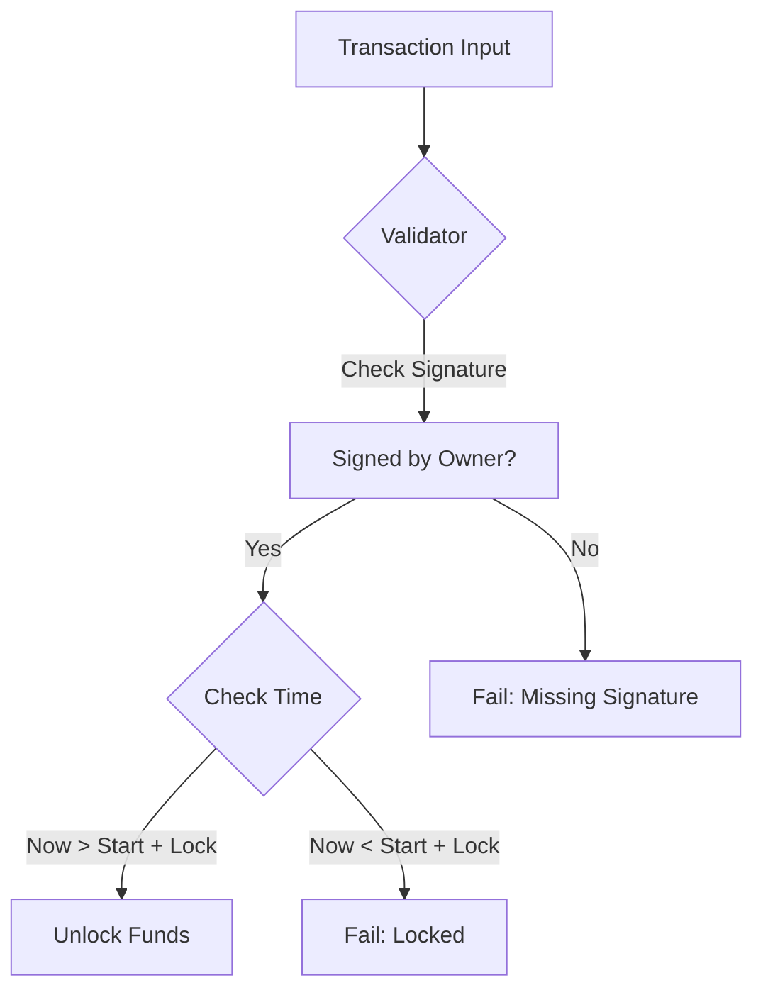

# Staking Smart Contract Walkthrough

I have implemented a Staking Smart Contract in Aiken that allows users to lock ADA for a set period and effectively "stake" it.

## Changes

### [staking.ak](file:///d:/Development/hello-world/validators/staking.ak)
This file contains the core validator logic.

- **Datum (`StakingDatum`)**: Stores the `owner`, `start_time` (when they staked), and the `lock_period_months`.
    > [!NOTE]
    > **Why is `lock_period_months` here?**
    > It is part of the Datum so that **one single contract** can handle different lock periods (1, 3, 6, 12 months). You define the period **when you construct the transaction** to deposit the funds, not when you compile the contract.

- **Redeemer (`StakingRedeemer`)**: Currently supports `Withdraw`.
- **Logic**:
    - **Signature Verification**: Ensures the transaction is signed by the `owner`.
    - **Time Lock**: Checks that the current transaction time (validity range) is strictly AFTER the `start_time` + `lock_period`.

## Visualization

Here is the flow of the validator:



## How to Test

You can run the included tests using Aiken:

```bash
aiken check
```

The tests cover:
1.  **Success**: Withdrawing after the lock period with the correct signature.
2.  **Failure**: Attempting to withdraw before the lock period expires.

> [!IMPORTANT]
> **Next Steps**: You need to replace the placeholder `test_token_policy` and `test_token_name` in `validators/staking.ak` with your actual $TEST token Policy ID and Asset Name if you want to enforce specific reward output logic in the future. Currently, the contract enforces the **lock** mechanism.
